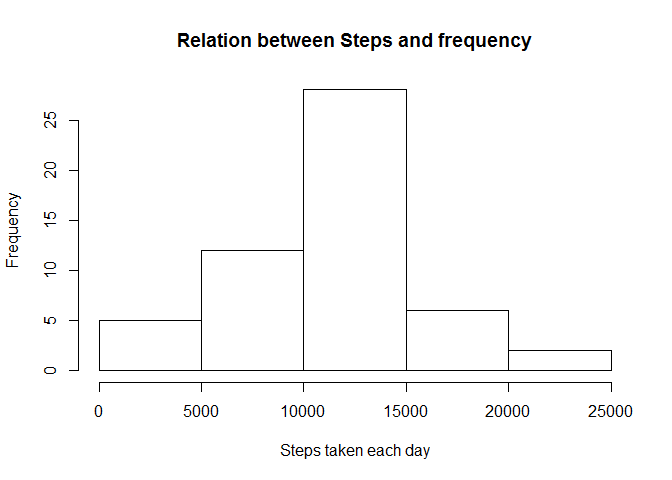
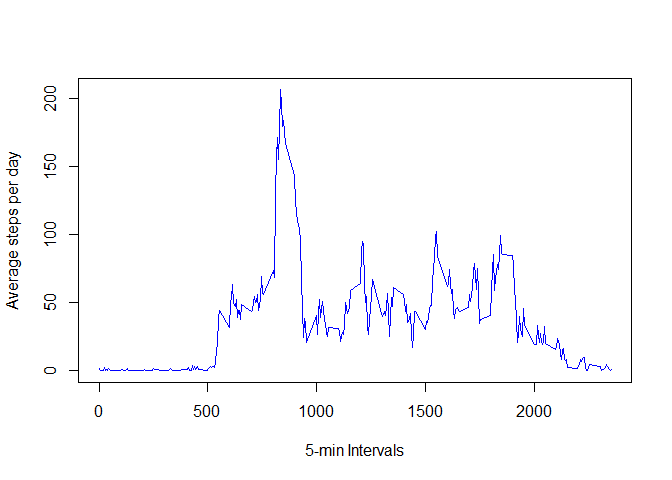
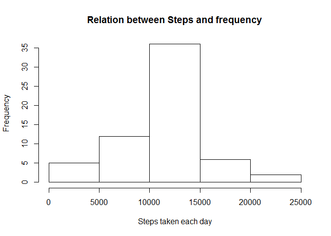
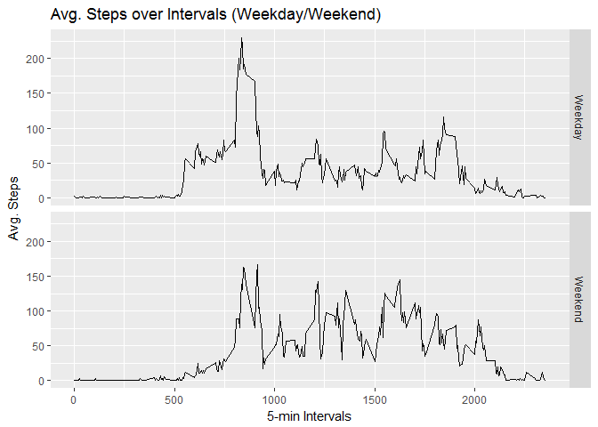

# Reproducible Research: Peer Assessment 1


## Loading and preprocessing the data


```r
mydata <- read.csv("activity.csv")
library(lattice)
mydata$date <- as.Date(mydata$date, "%Y-%m-%d")
```


## What is mean total number of steps taken per day?


```r
aggregateSteps <- aggregate(steps ~ date, data = mydata, sum, na.rm = TRUE)
mean <- mean(aggregateSteps$steps, na.rm=TRUE)
median <- median(aggregateSteps$steps, na.rm=TRUE)
```

The mean of steps taken each day is 1.0766189\times 10^{4} and median of steps taken each day is 10765.

The histogram of steps taken gives the same informations as following-


```r
hist(aggregateSteps$steps, xlab= "Steps taken each day", main= "Relation between Steps and frequency")
```

<!-- -->


## What is the average daily activity pattern?

The time-series plot between average number of steps and 5-minute intervals is as following-


```r
averaged_series <- tapply(mydata$steps, mydata$interval, mean, na.rm=TRUE)
plot(row.names(averaged_series), averaged_series, type="l", col="blue", xlab= "5-min Intervals", ylab="Average steps per day")
```

<!-- -->

```r
max_interval <- which.max(averaged_series)
```

The interval with maximum number of steps is 104

## Imputing missing values

Number of missing values:

```r
sum(is.na(mydata))
```

```
## [1] 2304
```

Replacing missing values with means of 5-minute intervals:

```r
steps_mean <- tapply(mydata$steps, mydata$interval, mean, na.rm=TRUE)
fillNA <- numeric()
for (i in 1:nrow(mydata)) {
    obs <- mydata[i, ]
    if (is.na(obs$steps)) {
        steps <- subset(steps_mean, row.names(steps_mean) == obs$interval)
    } else {
        steps <- obs$steps
    }
    fillNA <- c(fillNA, steps)
}
```

Creating new dataset with replaced issing values:

```r
new_data <- mydata
new_data$steps <- fillNA
```


```r
aggregateSteps2 <- aggregate(steps ~ date, data = new_data, sum, na.rm = TRUE)
mean2 <- mean(aggregateSteps2$steps, na.rm=TRUE)
median2 <- median(aggregateSteps2$steps, na.rm=TRUE)
```

The mean of steps taken each day is 1.0766189\times 10^{4} and median of steps taken each day is 1.0766189\times 10^{4}.

The histogram of steps taken gives the same informations as following-


```r
hist(aggregateSteps2$steps, xlab= "Steps taken each day", main= "Relation between Steps and frequency")
```

<!-- -->


## Are there differences in activity patterns between weekdays and weekends?

Create a new factor variable in dataset with two labels- "weekday" and "weekend":

```r
weekday <- weekdays(new_data$date)
day <- vector()
for (i in 1:nrow(new_data)) {
    if (weekday[i] == "Saturday") {
        day[i] <- "Weekend"
    } else if (weekday[i] == "Sunday") {
        day[i] <- "Weekend"
    } else {
        day[i] <- "Weekday"
    }
}
new_data$day <- day
new_data$day <- factor(new_data$day)
```

Plot the time series of average steps across all weekdays and weekends:


```r
aggregatesteps3 <- aggregate(new_data$steps, list(interval = as.numeric(as.character(new_data$interval)), 
                                                  weekdays = new_data$day),FUN = "mean")
avgSteps <- as.data.frame(aggregatesteps3)
library(ggplot2)
```

```
## Warning: package 'ggplot2' was built under R version 3.4.1
```

```r
plot <- ggplot(data= aggregatesteps3, aes(interval, x) ) + geom_line() + facet_grid(weekdays ~ .) + ylab("Avg. Steps") + xlab("5-min Intervals") + 
  ggtitle("Avg. Steps over Intervals (Weekday/Weekend)")
plot
```

<!-- -->
